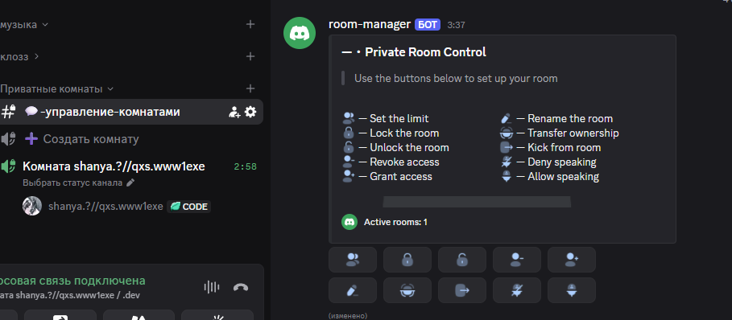
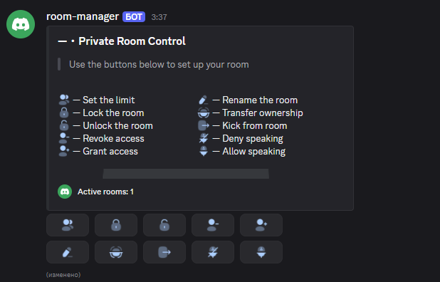
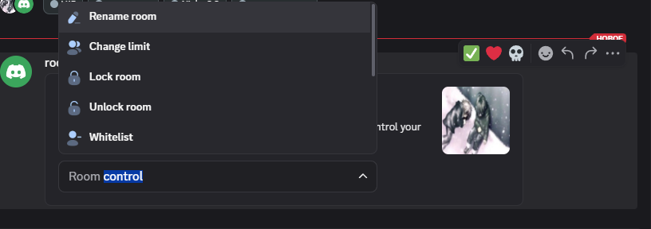

# 🎙️ Room Manager

<p align="center">
  <strong>Modern, fast, and feature-rich Discord temporary voice channel bot («Join to Create» / «Temp Voice»)</strong><br>
  Built with Bun, TypeScript, Discord.js 14, Discordx, PostgreSQL, and Redis.
</p>

<p align="center">
  <a href="README.ru.md"><strong>Русская версия</strong></a> •
  <a href="#-features"><strong>Features</strong></a> •
  <a href="#-two-panel-skins"><strong>2 Panel Skins</strong></a> •
  <a href="#-chat--voice-management"><strong>Chat Controls</strong></a> •
  <a href="#-quick-start"><strong>Quick Start</strong></a> •
  <a href="#-configuration"><strong>Configuration</strong></a>
</p>

<p align="center">
  
  
  
  
  
  
  
</p>

---

## 🌟 Overview

**Room Manager** automates temporary private voice channels on your Discord server with zero latency and enterprise-grade reliability.

<div align="center">



<br>

<sub>Room Manager — temporary voice channel management</sub>

</div>

### How it works

1. A member connects to a designated creator hub channel (e.g., `➕ Create Room`).
2. The bot instantly generates a private voice channel in the configured category, applies permission overrides, and grants room owner privileges.
3. The owner receives interactive control tools via a dedicated chat panel, within the voice channel's chat, or both.
4. Once all participants leave, the bot cleanly deletes the room on a configurable countdown timer.

---

## ✨ Features

- ⚡ **Instant Channel Creation:** Zero-delay channel creation with automated category permission inheritance.
- 🎨 **2 Distinct UI Skins:** Choose between the informative **Niako** skin and the sleek minimalist **Aruku** skin.
- 🎛️ **Dual Management Surfaces:** Control rooms from a dedicated text channel button panel, an in-voice channel dropdown menu, or both simultaneously.
- 🎭 **Dynamic Emoji Tinting:** The bot tints button icons on-the-fly to your chosen HEX color and uploads them as Discord Application Emojis.
- 🛡️ **Anti-Abuse Protections:** Configurable room creation cooldowns, member reassignment, and error recovery.
- 🌐 **Full Internationalization (i18n):** Native support for Russian (`ru`) and English (`en`).
- 🚀 **Optimized by Default:** Runs in a lightweight, single-process instance with minimal memory footprint. Multi-process sharding is available with a single flag for high-scale installations.

---

## 🎨 Two Panel Skins

Room Manager includes two distinct visual templates:

```text
┌───────────────────────────────────┬───────────────────────────────────┐
│        Skin 1: Niako (Default)    │        Skin 2: Aruku (Minimal)   │
├───────────────────────────────────┼───────────────────────────────────┤
│ • Full Discord Rich Embed         │ • Clean, modern minimalism       │
│ • Accent color side border        │ • Zero text or embed noise       │
│ • Title, subtitle & user guide    │ • High-impact artwork banner     │
│ • 10-action itemized legend       │ • Pure button control strip       │
│ • Banner + 2 rows of buttons      │ • Ideal for aesthetic servers     │
└───────────────────────────────────┴───────────────────────────────────┘
```

### 1. «Niako» Skin (Classic / Default)

- **Design Philosophy:** Complete clarity and comprehensive guidance for all community members.

- **Key Elements:**
  - **Customizable Embed:** Server accent color border (defaults to `#2B2D31`).
  - **Guidance Header:** Clean title (`—・Private Room Control`) and arrow prompt (`> Use the buttons below to set up your room`).
  - **Action Catalog:** Embed fields clearly listing each button's function and emoji.
  - **Banner Graphic:** Standard animated GIF or static image banner (uploadable or URL).
  - **2 Button Rows:** 10 action buttons arranged neatly below the embed.

### 2. «Aruku» Skin (Minimalist / Modern Aesthetic)

- **Design Philosophy:** Streamlined, distraction-free interface for sleek community aesthetics.

- **Key Elements:**
  - **`minimal: true` Mode:** Eliminates heavy embed text, footers, and descriptions.
  - **Dedicated Graphic Banner:** Premium artwork banner loaded from `assets/panel/banners/aruku.png`.
  - **Clean Button Strip:** 10 responsive action buttons placed directly below the banner artwork.
  - Recommended for gaming servers, anime communities, and aesthetic Discord themes.

> [!TIP]
> You can switch skins anytime with:
>
> `/setup settings` → **Design** → **Templates** → select `Niako` or `Aruku`.

---

## 💬 Chat & Voice Management

Room Manager gives you **three interaction modes** (`/setup settings` → **Control**):

1. **`chat` (Text Channel Only):** Control happens strictly through a persistent panel in a dedicated text channel (e.g., `#💬-room-control`). No messages are sent inside the voice channel.

2. **`voice` (In-Voice Only):** When a room is created, a Components V2 dropdown menu is posted into the temporary channel's built-in text chat. No permanent text channel is needed.

3. **`both` (Dual Mode / Default):** The ultimate experience — members can manage from the centralized text panel or quickly adjust settings from within the voice chat without leaving.

### 🎛️ Control Interfaces

<div align="center">

<table>
<tr>

<td align="center" width="50%">



<br>

<sub><strong>Control Panel</strong></sub>

</td>

<td align="center" width="50%">



<br>

<sub><strong>In-Voice Controls</strong></sub>

</td>

</tr>
</table>

</div>

---

### 🎛️ Interactive Panel Buttons

All button actions trigger private, ephemeral modal dialogues or user-select menus — **never cluttering public chat**!

| Button | Action | Description |
| :---: | :--- | :--- |
| 👥 | **Limit** (`room:limit`) | Set max participant capacity (from `0` for unlimited up to `99`). |
| 🔒 | **Lock** (`room:lock`) | Revoke `@everyone` connect permission (only whitelisted users can join). |
| 🔓 | **Unlock** (`room:unlock`) | Restore connect permissions for all server members. |
| ➕ | **Add Access** (`room:access:add`) | Select a user to grant explicit connect access to your locked room. |
| ➖ | **Remove Access** (`room:access:remove`) | Revoke personal access from a previously whitelisted user. |
| 📝 | **Rename** (`room:rename`) | Rename your temporary channel with automatic rate-limit protection. |
| 👑 | **Transfer** (`room:owner`) | Pass room ownership privileges to any member present in the room. |
| 👢 | **Kick** (`room:kick`) | Disconnect an unwanted user or troll from your private voice space. |
| 🔇 | **Mute** (`room:mute`) | Locally server-mute an annoying member inside your room. |
| 🔊 | **Unmute** (`room:unmute`) | Restore speaking privileges to a muted member. |

---

### 🎙️ In-Voice Dropdown Menu (`room:vc:manage`)

When in-voice control is enabled, a sleek select menu is dispatched to the room's chat:

- 📝 **Rename:** Modal dialog to modify channel name.
- 👥 **Change Limit:** Set user limit on the fly.
- 🔒 **Lock / Unlock:** Instant privacy toggle.
- 📋 **Whitelist:** View and manage invited members.
- 👑 **Transfer Owner:** User select dropdown to transfer master role.
- 👢 **Kick Member:** Rapidly evict intruders.
- 🔇 **Mute Controls:** Mute or unmute participants.
- 🎵 **Soundpad:** Toggle Discord soundboard (`UseSoundboard`) permissions.
- 🎮 **Activities:** Enable or disable embedded voice games & YouTube Watch Together (`UseEmbeddedActivities`).

---

## 🚀 Quick Start

### Prerequisites

- **Node.js** 22+ or **Bun** 1.3+
- **Docker** & **Docker Compose** (recommended for production)
- A Discord Bot Token with the following privileged Gateway Intents enabled:
  - `Server Members Intent`
  - `Message Content Intent`

---

### Method 1: Docker Compose (Recommended)

1. **Clone the repository:**

   ```bash
   git clone https://github.com/shzanya/room-manager.git
   cd room-manager
   ```

2. **Configure environment:**

   ```bash
   cp .env.docker .env
   ```

   Fill in your credentials:

   - `DISCORD_TOKEN` — bot token from the Discord Developer Portal
   - `DISCORD_CLIENT_ID` — your application ID

3. **Launch the stack:**

   ```bash
   docker compose up -d --build
   ```

4. **Verify status & health:**

   ```bash
   docker compose ps
   curl http://localhost:9090/health
   ```

---

### Method 2: Local Setup (Node.js / Bun)

1. **Install dependencies:**

   ```bash
   bun install --frozen-lockfile
   bun add tsx
   ```

2. **Start backend services (PostgreSQL + Redis):**

   ```bash
   docker compose -f docker-compose.infra.yml up -d
   ```

3. **Configure environment:**

   ```bash
   cp .env.example .env
   ```

4. **Start the bot:**

   ```bash
   # Standard mode (no sharding, default)
   bun run start

   # Or using Node.js directly:
   bun run --cwd apps/bot start
   ```

---

## ⚙️ Configuration

### Environment Variables (`.env`)

| Variable | Default | Description |
| :--- | :---: | :--- |
| `NODE_ENV` | `development` | Environment mode (`development` / `production`). |
| `DISCORD_TOKEN` | **required** | Discord bot secret token. |
| `DISCORD_CLIENT_ID` | **required** | Discord application client ID. |
| `DATABASE_URL` | `postgresql://...` | PostgreSQL connection string. |
| `REDIS_URL` | `redis://localhost:6379` | Redis connection URL for caching and queues. |
| `DATABASE_SSL` | `false` | Enable SSL for PostgreSQL connection (`true`/`false`). |
| `LOG_LEVEL` | `info` | Pino log level (`debug`, `info`, `warn`, `error`). |
| `METRICS_PORT` | `9090` | HTTP port for Prometheus metrics and `/health` probes. |
| `ENABLE_SHARDING` | `false` | **Disabled by default.** Enable (`true`) to run multi-process ShardingManager. |
| `TOTAL_SHARDS` | `3` | Total shards when sharding is explicitly enabled. |

> [!NOTE]
> **Sharding is disabled by default.** For 99% of deployments, single-instance execution delivers superior latency, uses minimal RAM, and keeps the Prometheus `/health` endpoint responsive on port `9090`. For high-scale deployments (2,500+ guilds), enable sharding via `ENABLE_SHARDING=true` or run `npm run start:shard`.

---

## 🛠️ Slash Commands Reference

All setup commands require the `ManageGuild` permission:

### `/setup basic`

One-click setup wizard for new servers.

**Optional Arguments:**

- `category` — Existing category for temporary rooms.
- `hub` — Existing voice channel to use as the creator hub.
- `panel` — Existing text channel for the button panel.

If arguments are omitted, the bot **automatically creates and configures the category, hub channel, and control panel with proper permissions**.

### `/setup settings`

Interactive server dashboard directly inside Discord:

- 🎨 **Design:** Select skin (**Niako** / **Aruku**), upload custom banner or URL, customize text.
- 🎛️ **Control:** Select control surfaces (`chat`, `voice`, `both`), instant deletion, default privacy.
- 🎭 **Icons:** Choose icon packs, apply dynamic color presets (Neon, Dark, Pastel, Rainbow).
- 🛡️ **Roles:** Configure blacklist/whitelist roles for room creation.
- 🌐 **Language:** Toggle between English and Russian.

### `/stats`

Live performance monitor:

- WebSocket latency, process uptime, average command execution time.
- Memory allocation and CPU metrics.
- Active room count, guild count, and total cached users.

---

## 🏗️ Repository Architecture

```text
room-manager/
├── 📱 apps/
│   ├── 🤖 bot/                 # Main Discord bot runtime
│   │   ├── 🎨 assets/          # Artwork: banners, templates, icons
│   │   └── ⚡ src/             # Commands, event listeners, Components V2
│   ├── 🌐 api/                 # HTTP API gateway scaffold
│   └── 📊 dashboard/           # Web administration dashboard scaffold
│
├── 📦 packages/
│   ├── ⚙️ config/              # Zod environment schema & parser
│   ├── 📐 contracts/           # Domain models, room contracts & constants
│   ├── 🧠 core/                # Core room lifecycle state machine & policies
│   ├── 🗄️ database/            # Drizzle ORM repositories & PostgreSQL client
│   ├── 📝 logger/              # High-performance structured Pino logger
│   ├── 📡 observability/       # Health checks and Prometheus metrics server
│   └── 🧩 shared/              # Branded types, shared errors, utility functions
│
├── 🐳 docker/                  # Docker entrypoint & Nginx load balancer configs
├── 🐳 docker-compose.yml       # Production stack: Postgres + Redis + Bot + Nginx
└── 🧰 docker-compose.infra.yml # Infrastructure-only compose for local dev
```

---

## 📄 License

This project is licensed under the [MIT License](LICENSE).